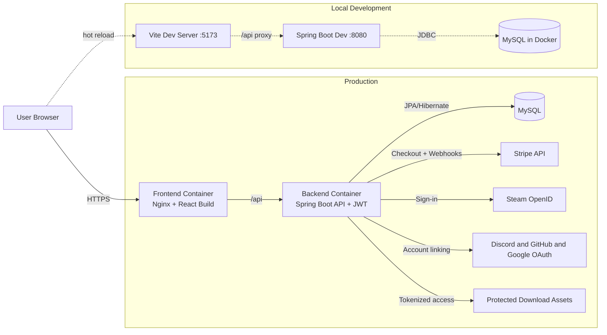
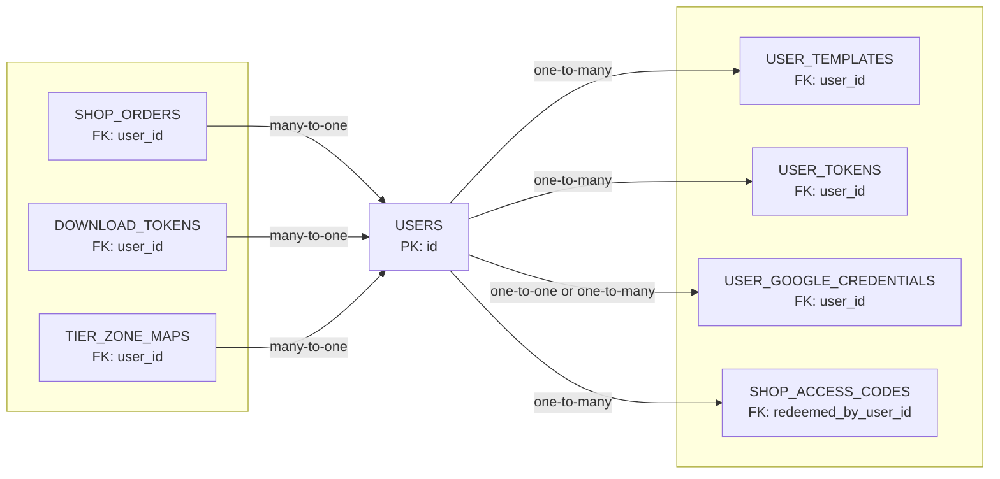

	

<strong>Mod shop, account linking, and secure download platform for OverKill products.</strong>

## About OverKillDevelopment
I built OverKillDevelopment to run my product ecosystem in one place: secure sign-in, paid access management, and controlled delivery of private mod downloads without relying on multiple disconnected services.

## Features
- Steam OpenID authentication with JWT-based sessions
- Account linking for Discord, GitHub, and Google
- Stripe checkout and subscription flows with idempotency support
- Purchase history, release gating, and access-code redemption
- Secure one-time download token flow for protected files
- Webhook safety with duplicate event protection and payment reconciliation
- User-owned template integrations and sync support
- Containerized local development with frontend/backend split

## Technology Stack
- **Backend:** Spring Boot (REST) + JPA/Hibernate
- **Frontend:** React + Vite
- **Database:** MySQL
- **Auth:** Steam OpenID + OAuth (Discord, GitHub, Google) + JWT
- **Payments:** Stripe Checkout + Webhooks
- **Build Tool:** Maven
- **Containerization:** Docker, Docker Compose
- **CI/CD:** Jenkins

## Architecture

OverKillDevelopment is a container-friendly full-stack app with a React frontend, Spring Boot API, and MySQL persistence, built around authentication, product ownership, and secure digital delivery.

### System Architecture

### Database Relationship Diagram

